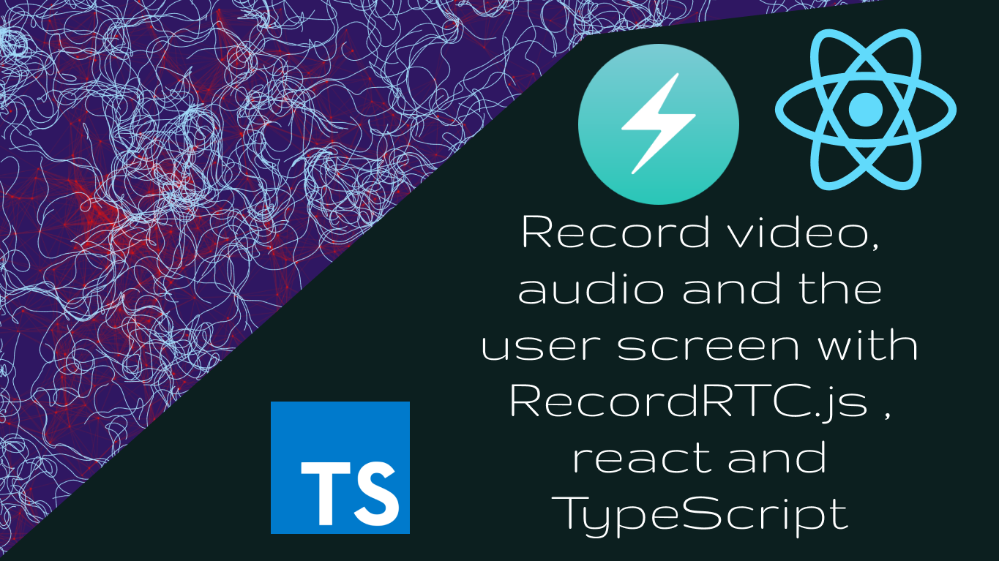

# react-recordrtc-yt

see demo here
https://mohammedal-rowad.github.io/react-recordrtc-yt/

### How to install it locally

```bash
$ git clone https://github.com/MohammedAl-Rowad/react-recordrtc-yt.git
$ cd react-recordrtc-yt
$ git checkout code
$ npm i
$ npm run start
```


